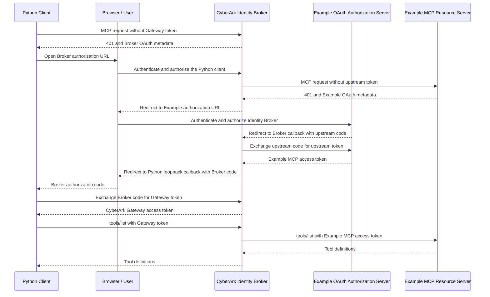

# Example MCP Server OAuth Client

A dedicated Python client that accesses the Example MCP server through the
CyberArk Identity Broker / Secure AI Gateway. The client authenticates to the
Gateway using OAuth authorization code flow with PKCE, then lists the MCP tools
that the Gateway exposes for the `mcp-example` target.

```text
Client -- OAuth --> CyberArk Identity Broker / Gateway --> Example MCP Server
```

This client does not connect directly to
`https://example-server.modelcontextprotocol.io/mcp`.

## Authentication sequence

The Python client starts the CyberArk Identity Broker OAuth flow first. If the
Identity Broker does not already hold a valid token for the Example MCP server,
it completes the Example MCP server's OAuth flow before the Broker authorization
finishes. The two access tokens stay at different layers: the Python client
holds only the CyberArk Gateway token, while the Identity Broker holds the
Example MCP server token.



The browser may display both authorization experiences in one redirect chain,
but the Example OAuth callback returns to the Identity Broker, not directly to
the Python loopback callback. Only the final CyberArk Broker authorization code
returns to `http://127.0.0.1:8765/oauth/callback`.

## Configuration files

The CyberArk registration output is split across two JSON documents:

- `lhan_mcp_client-connect.mcp-example.json` is target-specific. It contains
  the `mcp-example` Gateway URL, OAuth endpoints, and `clientId`.
- `lhan_mcp_client-credentials.json` contains the matching `clientId` and
  `clientSecret` for the registered AI agent.

Both files are required and are read from this directory. Their `clientId`
values must match.

The connect and credentials files are ignored by Git because they contain
environment-specific connection information and a client secret.

## Redirect URI

The default OAuth callback is:

```text
http://127.0.0.1:8765/oauth/callback
```

It must exactly match a redirect URL registered for the AI agent in CyberArk.
The callback listener exists only while authorization is in progress and waits
up to five minutes for the browser redirect.

## Run

Requires Python 3.10 or newer and [uv](https://docs.astral.sh/uv/).

```bash
uv sync
uv run python main.py
```

Each run opens the CyberArk authorization page because tokens are kept only in
memory. After login, the client calls `tools/list` and prints the complete tool
definitions as JSON.

To use another registered loopback callback:

```bash
uv run python main.py \
  --redirect-uri http://127.0.0.1:9000/oauth/callback
```

Every outgoing HTTP request is printed before it is sent. Sensitive Header
values such as `Authorization` and cookies are replaced with `<redacted>`.
